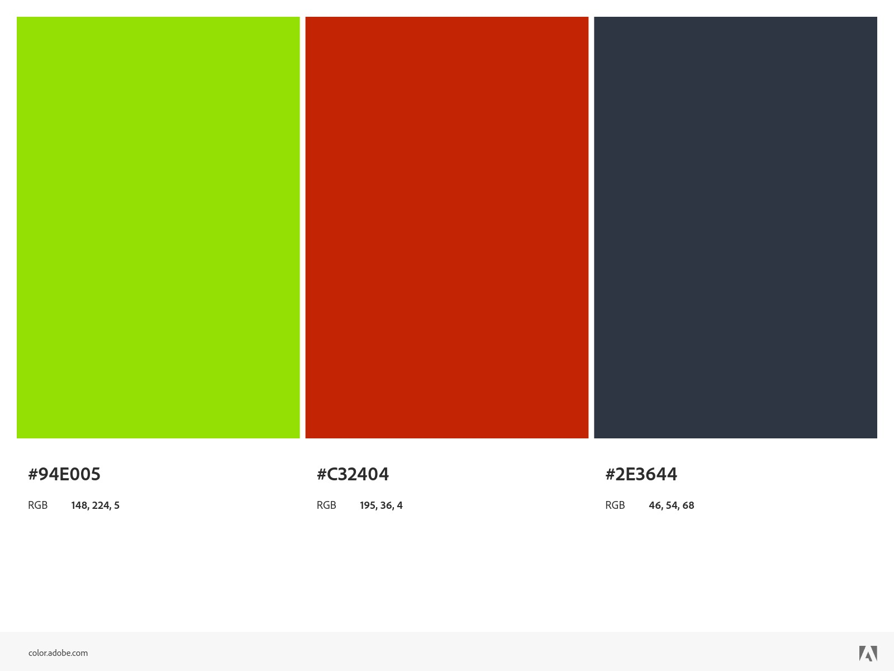

# Splan
## Link
[whimsical](https://whimsical.com/anglais-wireframe-K3z5NUtYfhwbWKB1QEyksD)
## Installation

To render the website follow these steps :

> If you are using windows please use Git Bash for the following steps

1. Install [Node Js](https://nodejs.org/en/download)
2. Clone 
    ```sh
    git clone https://gricad-gitlab.univ-grenoble-alpes.fr/iut2-info-stud/2024-s2/r2.01.03/d1/pellerai/splan.git
    ```
3. Go to the splan folder
4. Install module
    ```sh
    npm install
    ```
5. Run the server
   ```sh
    npm run dev
    ```

## Project Pages
>These lists show items to do in order of **priority**

### Sport Plan

1. Link To google calendar

### Friend

1. Wireframe
2. Tinder swipe
3. Link to real account

### Account

1. Wireframe
2. Create account
3. Login
4. Database

### Color Code


